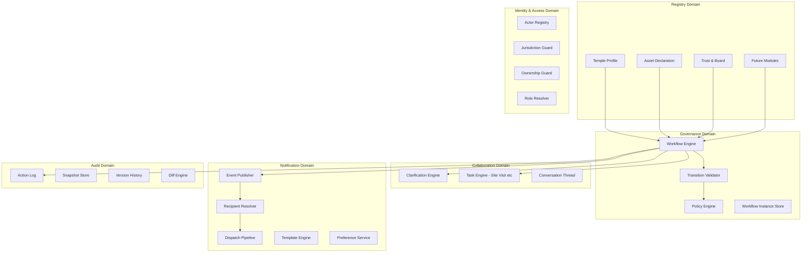
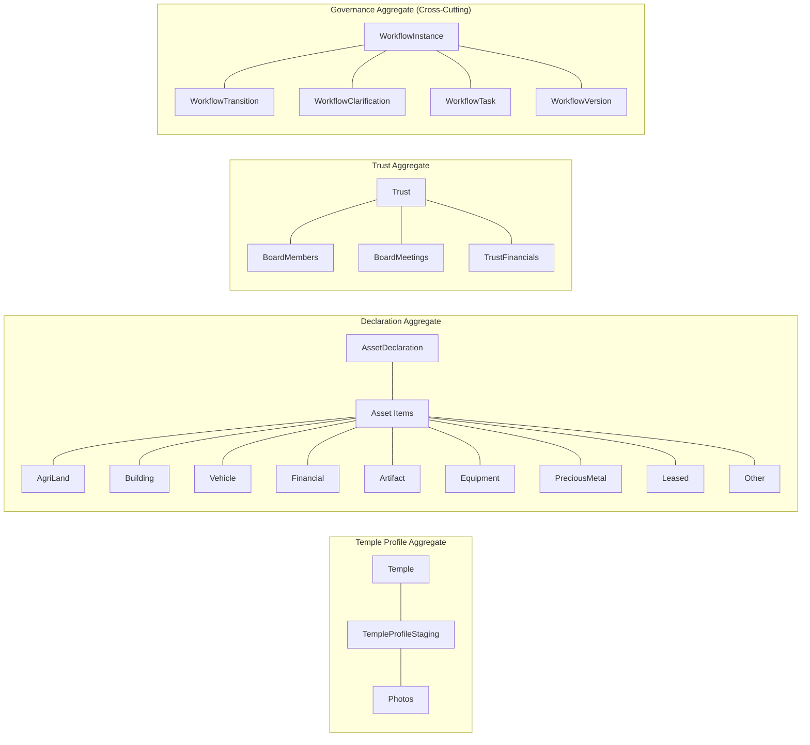
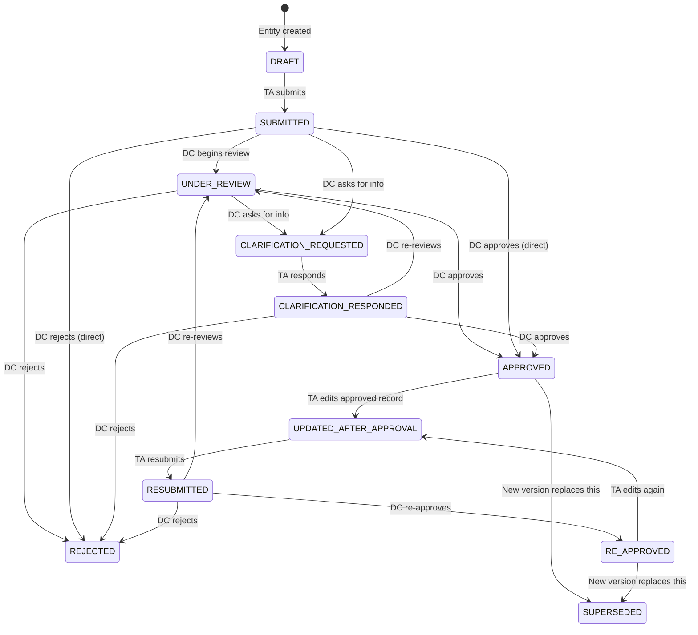
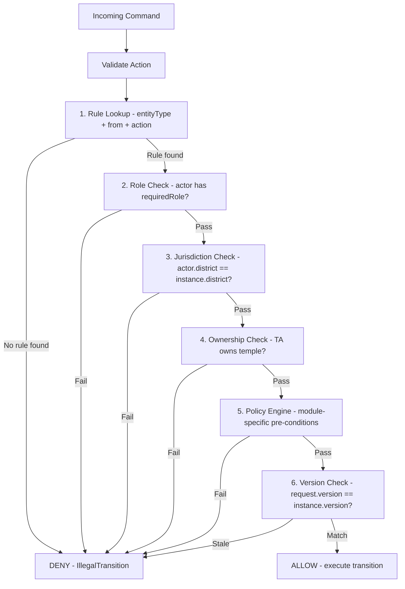

# Temple Registry — Architecture Recovery & Workflow Normalization Blueprint

## Part 1: Domain Architecture · Canonical Workflow · Governable Abstraction

> **Author Role:** Principal Architect  
> **Date:** 2026-04-28  
> **Status:** Proposal — Phase 3 of 3  
> **Predecessors:** [Workflow Audit Report](file:///C:/Users/adityaranjan/.gemini/antigravity/brain/c6a45db5-e407-4ea5-8fb4-b2179df5eaaa/artifacts/workflow_audit_report.md) · [Workflow Consistency Audit](file:///C:/Users/adityaranjan/.gemini/antigravity/brain/99a15a5b-d2a6-45b3-9f77-e947650bb603/artifacts/workflow_consistency_audit.md)

---

## Executive Summary

The Temple Registry backend has organically grown three independent governance engines across three modules (Temple Profile, Declaration, Trust & Board). This has produced 11+ status enums, dual-path service mutation on declarations, inconsistent clarification models, mixed notification pipelines, and no uniform concurrency control.

This blueprint proposes a **clean target architecture** that:

1. Introduces a **unified Governance Domain** with a single workflow engine
2. Replaces per-module state machines with a **canonical workflow model** backed by a `workflow_instance` table
3. Establishes a **composition-based Governable abstraction** — no inheritance hierarchy
4. Generalizes clarification, site visit, and notification into **reusable domain services**
5. Introduces **immutable versioning** with draft overlays for edit-after-approval
6. Standardizes concurrency via **optimistic locking + idempotent commands**
7. Provides a **staged migration path** with backward compatibility layers

---

## §1 — Domain Architecture Proposal

### 1.1 Bounded Contexts



### 1.2 Bounded Context Responsibilities

| Context | Responsibility | Owns |
|---|---|---|
| **Registry** | Domain data for each module (temple fields, asset items, trust members). Pure data — no workflow logic. | Entity tables, CRUD services, mappers |
| **Governance** | Workflow lifecycle: state transitions, validation, policy enforcement. Single engine for all modules. | `workflow_instance`, transition rules, policy configs |
| **Collaboration** | Cross-cutting interaction patterns: clarification threads, task assignments (site visit, inspection), conversations. | `clarification_thread`, `workflow_task`, `conversation` |
| **Notification** | Event-driven delivery of in-app, email, SMS notifications with recipient resolution and preference gating. | `notification_event`, `in_app_notification`, `email_delivery_log`, templates |
| **Audit** | Immutable record of all governance actions, entity snapshots, version diffs. | `governance_action_history`, `entity_snapshot`, `entity_version` |
| **Identity & Access** | Actor resolution, role-based access, jurisdiction scoping, ownership verification. | User/role tables, guards |

### 1.3 Aggregate Boundaries



**Key design rule:** Registry aggregates own their domain data. The Governance aggregate owns the workflow state. They are linked by a `(entityType, entityId)` composite reference — **not** by embedding workflow fields inside registry entities.

> [!IMPORTANT]
> This is the most critical architectural decision. Today, each entity (Trust, Declaration, TempleProfileStaging) embeds its own status fields. The target architecture **externalizes** workflow state into a dedicated `workflow_instance` table. Registry entities become pure data containers.

---

## §2 — Canonical Workflow Model

### 2.1 Single Source of Truth

**Current problem:** Status lives in 5+ different fields across 3 entity types, with shadow enums (`DcDecisionStatus`) and boolean flags (`isVerifiedByDc`).

**Target:** One table, one status field, one engine.

```
┌─────────────────────────────────────────────────┐
│                workflow_instance                 │
├─────────────────────────────────────────────────┤
│ id               BIGINT PK                       │
│ entity_type      VARCHAR(50)   -- TEMPLE_PROFILE │
│                                -- DECLARATION    │
│                                -- TRUST          │
│                                -- BOARD_MEMBER   │
│ entity_id        BIGINT        -- FK to domain   │
│ status           VARCHAR(40)   -- canonical enum │
│ sub_status       VARCHAR(40)   -- nullable        │
│ version          INT           -- optimistic lock │
│ current_actor    VARCHAR(20)   -- TA / DC / SYS  │
│ district_id      BIGINT        -- jurisdiction    │
│ temple_id        BIGINT        -- ownership       │
│ created_by       BIGINT        -- submitter       │
│ created_at       TIMESTAMP                        │
│ updated_at       TIMESTAMP                        │
│ deadline_at      TIMESTAMP     -- SLA nullable    │
│ metadata_json    JSONB         -- module-specific │
└─────────────────────────────────────────────────┘
```

### 2.2 Base Workflow States

These are the **canonical states** shared by all governable entities:



**Canonical status enum (13 base values):**

```java
public enum WorkflowStatus {
    DRAFT,
    SUBMITTED,
    UNDER_REVIEW,
    CLARIFICATION_REQUESTED,
    CLARIFICATION_RESPONDED,
    RESUBMITTED,
    APPROVED,
    RE_APPROVED,
    REJECTED,
    UPDATED_AFTER_APPROVAL,
    SUPERSEDED,
    OVERDUE,
    WITHDRAWN
}
```

### 2.3 Sub-State / Capability Model

Instead of creating new top-level statuses for module-specific flows (which causes enum explosion), use a **sub-state** on `workflow_instance`:

| Module | Sub-State | Applies When Status = | Meaning |
|---|---|---|---|
| Declaration | `SITE_VISIT_SCHEDULED` | `UNDER_REVIEW` | DC scheduled a site visit |
| Declaration | `SITE_VISIT_COMPLETED` | `UNDER_REVIEW` | Inspector completed visit |
| Declaration | `PHYSICALLY_VERIFIED` | `UNDER_REVIEW` | DC verified site visit findings |
| Declaration | `VERIFICATION_FAILED` | `UNDER_REVIEW` | Site visit failed |
| Future | `LEGAL_REVIEW_PENDING` | `UNDER_REVIEW` | Awaiting legal clearance |
| Future | `FINANCIAL_AUDIT_PENDING` | `UNDER_REVIEW` | Awaiting financial audit |
| Future | `ESCALATED_TO_SUPER_ADMIN` | `CLARIFICATION_REQUESTED` | Round 2+ escalation |

**Rule:** Sub-states are scoped within a parent status. They do NOT create new top-level transitions. The base state machine remains unchanged.

### 2.4 Action Model

Every state change is triggered by a **command action**:

```java
public enum WorkflowAction {
    // TA actions
    SUBMIT, RESUBMIT, RESPOND_CLARIFICATION, WITHDRAW, EDIT_APPROVED,

    // DC actions
    BEGIN_REVIEW, APPROVE, REJECT, REQUEST_CLARIFICATION,
    SEND_BACK, RE_APPROVE,

    // Task actions
    SCHEDULE_SITE_VISIT, COMPLETE_SITE_VISIT, VERIFY_SITE_VISIT,
    FAIL_SITE_VISIT,

    // System actions
    FLAG_OVERDUE, ESCALATE, AUTO_SUPERSEDE, EXPIRE_DEADLINE
}
```

### 2.5 Transition Rules (Single Table)

All rules live in one structure — keyed by `(entityType, fromStatus, action) → toStatus`:

```java
record TransitionRule(
    String entityType,         // "*" for universal
    WorkflowStatus fromStatus,
    WorkflowAction action,
    WorkflowStatus toStatus,
    String requiredRole,       // TA, DC, SYSTEM
    String subStatusEffect,    // optional sub-state to set
    boolean clearSubStatus     // clear sub-state on transition?
) {}
```

Example rule set (partial):

| entityType | from | action | to | role | subStatusEffect |
|---|---|---|---|---|---|
| `*` | DRAFT | SUBMIT | SUBMITTED | TA | — |
| `*` | SUBMITTED | BEGIN_REVIEW | UNDER_REVIEW | DC | — |
| `*` | SUBMITTED | APPROVE | APPROVED | DC | — |
| `*` | UNDER_REVIEW | APPROVE | APPROVED | DC | — |
| `*` | UNDER_REVIEW | REQUEST_CLARIFICATION | CLARIFICATION_REQUESTED | DC | — |
| `*` | CLARIFICATION_REQUESTED | RESPOND_CLARIFICATION | CLARIFICATION_RESPONDED | TA | — |
| `*` | APPROVED | EDIT_APPROVED | UPDATED_AFTER_APPROVAL | TA | — |
| `*` | UPDATED_AFTER_APPROVAL | RESUBMIT | RESUBMITTED | TA | — |
| DECLARATION | UNDER_REVIEW | SCHEDULE_SITE_VISIT | UNDER_REVIEW | DC | SITE_VISIT_SCHEDULED |
| DECLARATION | UNDER_REVIEW | COMPLETE_SITE_VISIT | UNDER_REVIEW | DC | SITE_VISIT_COMPLETED |
| DECLARATION | UNDER_REVIEW | VERIFY_SITE_VISIT | UNDER_REVIEW | DC | PHYSICALLY_VERIFIED |

### 2.6 Transition Validator Strategy



### 2.7 Policy Engine Design

For module-specific business rules that go beyond simple transition validation:

```java
public interface WorkflowPolicy {
    String entityType();  // which module this applies to
    WorkflowAction action();  // which action triggers this
    PolicyResult evaluate(WorkflowInstance instance, ActionContext ctx);
}

// Example: Declaration cannot be approved if site visit failed
public class SiteVisitBlocksApprovalPolicy implements WorkflowPolicy {
    public String entityType() { return "DECLARATION"; }
    public WorkflowAction action() { return WorkflowAction.APPROVE; }
    public PolicyResult evaluate(WorkflowInstance inst, ActionContext ctx) {
        if ("VERIFICATION_FAILED".equals(inst.getSubStatus())) {
            return PolicyResult.deny("Cannot approve: site visit verification failed");
        }
        return PolicyResult.allow();
    }
}
```

**Policy registration:** Policies are Spring beans discovered via `@Component`. The `WorkflowEngine` collects all `WorkflowPolicy` beans and evaluates matching ones before each transition.

### 2.8 Workflow Capabilities Per Module

| Capability | Temple Profile | Declaration | Trust | Board Member |
|---|---|---|---|---|
| Base lifecycle (Draft→Submit→Approve/Reject) | ✅ | ✅ | ✅ | ✅ |
| Clarification rounds | ✅ (add) | ✅ | ✅ (upgrade from sendBackReason) | ❌ |
| Sub-state tasks (site visit) | ❌ | ✅ | ❌ | ❌ |
| Edit-after-approval | ✅ | ✅ | ✅ | ❌ (parent governs) |
| Version history | ✅ (SUPERSEDED) | ✅ (AssetDeclarationVersion) | ✅ (add) | ❌ |
| Overdue handling | ❌ | ✅ | ❌ | ❌ |
| Escalation | ❌ | ✅ (round 2→SUPER_ADMIN) | ❌ (add) | ❌ |
| SLA / deadlines | ❌ | ✅ (add) | ❌ (add) | ❌ |

---

## §3 — Governable Abstraction

### 3.1 Options Analysis

| Option | Description | Pros | Cons |
|---|---|---|---|
| **A. Interface** | `GovernableEntity` interface on each entity | Simple, type-safe | Embeds status in entity (current problem), each entity still manages own fields |
| **B. Abstract Base** | `AbstractGovernableEntity extends BaseEntity` | Shared fields via inheritance | Java single inheritance limitation, couples domain to governance, migration nightmare |
| **C. Composition** | Separate `WorkflowInstance` table linked by `(entityType, entityId)` | Clean separation, no entity changes needed, unlimited modules | Extra join on reads, requires careful consistency |
| **D. Embedded Component** | `@Embedded WorkflowState` component in each entity | Keeps single table, shared column names | Still embeds in entity, migration requires ALTER TABLE on all entities |

### 3.2 Recommendation: Option C — Composition via WorkflowInstance Table

**Justification:**

1. **No entity modification required** — Temple, Declaration, Trust entities keep their existing columns during migration. New workflow state lives in `workflow_instance`.
2. **Unlimited extensibility** — Adding a new governable module = inserting a new `entityType` string. No enum changes, no new tables, no new service classes.
3. **Single query point** — "Show me all pending items for DC in district X" becomes `SELECT * FROM workflow_instance WHERE district_id = ? AND status = 'SUBMITTED'` — one query, all modules.
4. **Clean audit** — Governance action history links to `workflow_instance.id`, not to disparate entity tables.
5. **Backward compatibility** — During migration, a compatibility layer can sync `workflow_instance.status` ↔ `entity.status` bidirectionally.

**Tradeoffs to manage:**

| Concern | Mitigation |
|---|---|
| Extra JOIN on reads | Create a `WorkflowAwareDTO` that combines entity data + workflow state in the service layer. Cache workflow state in Redis if needed. |
| Consistency between entity and workflow_instance | During migration: DB trigger or `@PostPersist` listener syncs. Post-migration: entity status columns become derived/read-only. |
| Orphaned workflow instances | Cascading soft-delete. Nightly reconciliation job. |

### 3.3 Service Contract

```java
public interface WorkflowEngine {

    /** Create a workflow instance for a new governable entity */
    WorkflowInstance initiate(String entityType, Long entityId,
                              Long templeId, Long districtId, Long createdBy);

    /** Execute a workflow action (submit, approve, reject, etc.) */
    WorkflowTransitionResult execute(Long workflowInstanceId,
                                      WorkflowAction action,
                                      ActionContext context);

    /** Query current state */
    WorkflowInstance getState(String entityType, Long entityId);

    /** List available actions for current user on this instance */
    List<WorkflowAction> getAvailableActions(Long workflowInstanceId,
                                              Long actorId);

    /** Bulk query for dashboards */
    Page<WorkflowInstance> findByFilters(WorkflowQueryFilter filter,
                                         Pageable pageable);
}
```

### 3.4 How Each Module Integrates

**Temple Profile Staging:**
```
TempleProfileStagingServiceImpl.createOrUpdateDraft()
  → workflowEngine.initiate("TEMPLE_PROFILE", stagingId, ...)
  → returns WorkflowInstance(status=DRAFT)

TempleProfileStagingServiceImpl.submitForReview()
  → workflowEngine.execute(instanceId, SUBMIT, context)
  → engine validates, transitions to SUBMITTED
  → engine publishes WorkflowTransitionEvent
  → NotificationListener picks up event → notifies DC
  → DOES NOT call promoteToTemple() (that's only on APPROVE)
```

**Declaration:**
```
GovernanceWorkflowServiceImpl.submitDeclaration()
  → workflowEngine.execute(instanceId, SUBMIT, context)
  → engine validates via TransitionRule + PolicyEngine
  → transition recorded in workflow_transition table
  → WorkflowTransitionEvent published
```

**Trust:**
```
GovernanceWorkflowServiceImpl.submitTrust()
  → workflowEngine.execute(instanceId, SUBMIT, context)
  → same engine, same validation, same event pipeline
```

**Board Member:**
```
TrustServiceImpl.approveBoardMember()
  → workflowEngine.execute(boardMemberInstanceId, APPROVE, context)
  → replaces boolean isVerifiedByDc with proper state machine
  → same audit trail as any other governable entity
```
