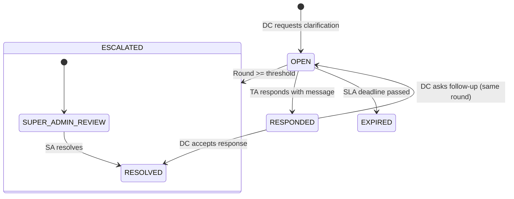
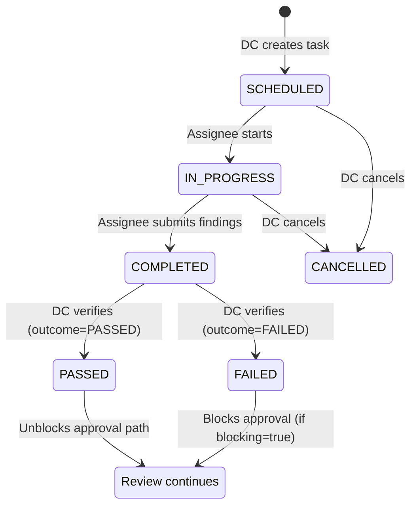
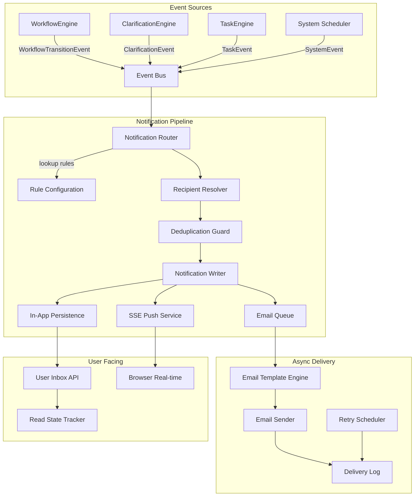

# Temple Registry — Architecture Recovery Blueprint

## Part 2: Clarification · Site Visit · Notification Architecture

> Continuation of [Part 1](file:///C:/Users/adityaranjan/.gemini/antigravity/brain/3ed610c3-7ddd-4f2b-b5be-db066be61a64/artifacts/architecture_blueprint_part1.md)

---

## §4 — Clarification Architecture

### 4.1 Current State (Problems)

| Aspect | Declaration | Trust | Temple Profile |
|---|---|---|---|
| Model | `DeclarationClarification` entity — full threaded model | Single `sendBackReason` string field on Trust entity | ❌ Not supported |
| Direction | Bidirectional (`DC_TO_TEMPLE`, `TEMPLE_TO_DC`) | Unidirectional (DC → TA only) | N/A |
| Round tracking | `clarificationRound` on declaration (max 3) | None — unlimited send-backs | N/A |
| Field targeting | `sectionName` + `fieldNamesJson` | Generic reason string | N/A |
| Escalation | Round 2 → SUPER_ADMIN | None | N/A |
| History | Full thread preserved | Only latest reason (overwrites previous) | N/A |

**Core problem:** Declaration has a mature clarification system. Trust has a primitive one. Temple Profile has none. They are incompatible.

### 4.2 Target: Unified Clarification Engine

#### Data Model

```
┌──────────────────────────────────────────────────────┐
│               clarification_thread                    │
├──────────────────────────────────────────────────────┤
│ id                  BIGINT PK                         │
│ workflow_instance_id BIGINT FK → workflow_instance    │
│ round_number        INT          -- 1, 2, 3...        │
│ status              VARCHAR(20)  -- OPEN / RESPONDED  │
│                                  -- RESOLVED / EXPIRED│
│ requested_by        BIGINT FK → users                 │
│ requested_at        TIMESTAMP                         │
│ responded_by        BIGINT FK → users (nullable)      │
│ responded_at        TIMESTAMP (nullable)              │
│ resolved_by         BIGINT FK → users (nullable)      │
│ resolved_at         TIMESTAMP (nullable)              │
│ sla_deadline        TIMESTAMP (nullable)              │
│ escalation_level    INT DEFAULT 0                     │
│ created_at          TIMESTAMP                         │
│ updated_at          TIMESTAMP                         │
└──────────────────────────────────────────────────────┘

┌──────────────────────────────────────────────────────┐
│               clarification_message                   │
├──────────────────────────────────────────────────────┤
│ id                  BIGINT PK                         │
│ thread_id           BIGINT FK → clarification_thread  │
│ direction           VARCHAR(15)  -- DC_TO_TA / TA_TO_DC│
│ author_id           BIGINT FK → users                 │
│ message             TEXT                               │
│ section_name        VARCHAR(100) (nullable)            │
│ field_names_json    JSONB (nullable)                   │
│ created_at          TIMESTAMP                         │
└──────────────────────────────────────────────────────┘

┌──────────────────────────────────────────────────────┐
│            clarification_attachment                    │
├──────────────────────────────────────────────────────┤
│ id                  BIGINT PK                         │
│ message_id          BIGINT FK → clarification_message │
│ file_path           VARCHAR(500)                      │
│ file_name           VARCHAR(255)                      │
│ file_size           BIGINT                            │
│ content_type        VARCHAR(100)                      │
│ created_at          TIMESTAMP                         │
└──────────────────────────────────────────────────────┘
```

#### Lifecycle



#### Service Contract

```java
public interface ClarificationEngine {

    /** DC opens a new clarification round */
    ClarificationThread requestClarification(
        Long workflowInstanceId,
        ClarificationRequest request,  // message, sectionName, fieldNames
        Long requestedBy
    );

    /** TA responds to an open thread */
    ClarificationMessage respond(
        Long threadId,
        ClarificationResponse response,  // message, attachments
        Long respondedBy
    );

    /** DC resolves (accepts the response) */
    void resolve(Long threadId, Long resolvedBy);

    /** Query active threads for a workflow instance */
    List<ClarificationThread> getActiveThreads(Long workflowInstanceId);

    /** Full conversation history */
    List<ClarificationMessage> getHistory(Long workflowInstanceId);

    /** Summary for API response */
    ClarificationSummary getSummary(Long workflowInstanceId);
}
```

#### Key Design Decisions

| Decision | Rationale |
|---|---|
| **Thread per round**, not per message | Each DC request opens a new round/thread. TA responds within that thread. This preserves round counting and enables SLA per round. |
| **Bidirectional messages** | DC can follow up, TA can respond. Direction is explicit on each message. |
| **Field targeting is optional** | `sectionName` and `fieldNamesJson` are nullable. Simple modules (Temple Profile) can use plain text. Complex modules (Declaration) can target specific fields. |
| **SLA deadline per thread** | Each clarification round can have its own deadline. Expired threads can trigger overdue logic. |
| **Escalation is configurable per module** | Declaration escalates at round 2. Trust might escalate at round 3. Policy engine drives this. |
| **Attachments are first-class** | TA may need to upload supporting documents. Reuses existing `DocumentService` for storage. |

#### Clarification ↔ Workflow Integration

When DC calls `clarificationEngine.requestClarification()`:
1. Engine creates `clarification_thread` + initial `clarification_message`
2. Engine calls `workflowEngine.execute(instanceId, REQUEST_CLARIFICATION, ctx)` → transitions main status to `CLARIFICATION_REQUESTED`
3. `WorkflowTransitionEvent` published → Notification listener sends alert to TA

When TA calls `clarificationEngine.respond()`:
1. Engine adds `clarification_message` with direction `TA_TO_DC`
2. Engine updates thread status to `RESPONDED`
3. Engine calls `workflowEngine.execute(instanceId, RESPOND_CLARIFICATION, ctx)` → transitions main status to `CLARIFICATION_RESPONDED`
4. `WorkflowTransitionEvent` published → Notification listener sends alert to DC

> [!TIP]
> The clarification engine is a **collaborator** of the workflow engine, not embedded within it. This allows clarification to be used independently in future contexts (e.g., document review) without coupling to the governance lifecycle.

---

## §5 — Site Visit / Task Architecture

### 5.1 Current State (Problems)

Site visit is currently baked into the Declaration module:
- `PhysicalVerificationStatus` enum on `AssetDeclaration` entity
- `PhysicalVerificationHistory` table for DC-only audit
- `physicalVerificationStatus` runs as a **parallel track** alongside `DeclarationStatus`
- Blocking rule: `VERIFICATION_FAILED` prevents approval — but this is hardcoded in `GovernanceWorkflowServiceImpl`

**Core problem:** This is a **task pattern** (assign → execute → report findings → close) that has been implemented as entity-level status fields. It cannot be reused for future task types (legal review, financial audit, document verification).

### 5.2 Target: Generalized Workflow Task Engine

#### Data Model

```
┌──────────────────────────────────────────────────────┐
│                  workflow_task                         │
├──────────────────────────────────────────────────────┤
│ id                  BIGINT PK                         │
│ workflow_instance_id BIGINT FK → workflow_instance    │
│ task_type           VARCHAR(40)  -- SITE_VISIT        │
│                                  -- DOCUMENT_VERIFY   │
│                                  -- LEGAL_REVIEW      │
│                                  -- FINANCIAL_AUDIT   │
│ status              VARCHAR(20)  -- SCHEDULED         │
│                                  -- IN_PROGRESS       │
│                                  -- COMPLETED         │
│                                  -- FAILED            │
│                                  -- CANCELLED         │
│ assigned_to         BIGINT FK → users                 │
│ assigned_by         BIGINT FK → users                 │
│ scheduled_date      DATE (nullable)                   │
│ completed_date      DATE (nullable)                   │
│ outcome             VARCHAR(20)  -- PASSED / FAILED   │
│                                  -- INCONCLUSIVE      │
│ blocking            BOOLEAN      -- blocks approval?  │
│ version             INT          -- optimistic lock    │
│ created_at          TIMESTAMP                         │
│ updated_at          TIMESTAMP                         │
└──────────────────────────────────────────────────────┘

┌──────────────────────────────────────────────────────┐
│                 task_finding                           │
├──────────────────────────────────────────────────────┤
│ id                  BIGINT PK                         │
│ task_id             BIGINT FK → workflow_task         │
│ finding_type        VARCHAR(40)  -- OBSERVATION       │
│                                  -- DISCREPANCY       │
│                                  -- CONFIRMATION      │
│ description         TEXT                               │
│ section_name        VARCHAR(100) (nullable)            │
│ severity            VARCHAR(10)  -- LOW/MEDIUM/HIGH   │
│ recorded_by         BIGINT FK → users                 │
│ created_at          TIMESTAMP                         │
└──────────────────────────────────────────────────────┘

┌──────────────────────────────────────────────────────┐
│                  task_media                            │
├──────────────────────────────────────────────────────┤
│ id                  BIGINT PK                         │
│ task_id             BIGINT FK → workflow_task         │
│ finding_id          BIGINT FK → task_finding (nullable)│
│ file_path           VARCHAR(500)                      │
│ file_name           VARCHAR(255)                      │
│ media_type          VARCHAR(20)  -- PHOTO/VIDEO/DOC   │
│ caption             VARCHAR(500) (nullable)            │
│ geo_latitude        DECIMAL(10,7) (nullable)          │
│ geo_longitude       DECIMAL(10,7) (nullable)          │
│ captured_at         TIMESTAMP (nullable)              │
│ created_at          TIMESTAMP                         │
└──────────────────────────────────────────────────────┘
```

#### Task Lifecycle



#### Service Contract

```java
public interface WorkflowTaskEngine {

    /** Create a new task on a workflow instance */
    WorkflowTask createTask(Long workflowInstanceId, TaskCreateRequest request);

    /** Assignee starts the task */
    void startTask(Long taskId, Long assigneeId);

    /** Assignee records findings and completes */
    void completeTask(Long taskId, TaskCompletionRequest request);

    /** DC verifies completion and records outcome */
    void verifyTask(Long taskId, TaskVerificationRequest request);

    /** Cancel a task */
    void cancelTask(Long taskId, Long cancelledBy, String reason);

    /** Get all tasks for a workflow instance */
    List<WorkflowTask> getTasks(Long workflowInstanceId);

    /** Check if any blocking tasks are unresolved */
    boolean hasBlockingTasks(Long workflowInstanceId);
}
```

#### Task ↔ Workflow Integration

When DC calls `taskEngine.createTask()` for a site visit:
1. Task created with `status=SCHEDULED`, `blocking=true`
2. `workflowEngine` sub-status updated: `SITE_VISIT_SCHEDULED`
3. `WorkflowTaskCreatedEvent` published → Notification to assignee + TA

When assignee calls `taskEngine.completeTask()`:
1. Findings and media recorded
2. Task status → `COMPLETED`
3. Sub-status updated: `SITE_VISIT_COMPLETED`

When DC calls `taskEngine.verifyTask(outcome=PASSED)`:
1. Task outcome set to `PASSED`
2. Sub-status updated: `PHYSICALLY_VERIFIED`
3. Blocking constraint removed → approval path unblocked

#### Policy Integration

The existing `SiteVisitBlocksApprovalPolicy` (from §2.7) queries the task engine:

```java
public PolicyResult evaluate(WorkflowInstance inst, ActionContext ctx) {
    if (taskEngine.hasBlockingTasks(inst.getId())) {
        return PolicyResult.deny("Blocking tasks must be resolved before approval");
    }
    return PolicyResult.allow();
}
```

> [!IMPORTANT]
> By modeling site visits as tasks, future needs (document verification, legal review, financial audit) require ZERO new status enums, ZERO new tables, ZERO new service classes. Just a new `task_type` string and optionally a new `WorkflowPolicy` bean.

---

## §6 — Notification Architecture

### 6.1 Current State (Problems)

The system has **two coexisting notification pipelines** with different capabilities:

| Pipeline | Classes | Creates InApp? | Sends Email? | SSE Push? | Used By |
|---|---|---|---|---|---|
| **Legacy** | `NotificationService.notify()` → `NotificationServiceImpl` | ✅ (basic) | ❌ | ❌ | Temple Profile submit |
| **Legacy Publisher** | `NotificationEventPublisherImpl` (dc package) | ❌ (event row only) | ❌ | ❌ | Declaration overdue, resubmit |
| **Modern** | `NotificationHelper` → `NotificationEventPublisher` → `NotificationDispatchServiceImpl` | ✅ | ✅ | ✅ | Governance workflow (Trust, Declaration approve/reject) |

**Results:**
- Some notifications create event rows but never reach the user's inbox
- Temple Profile uses a different system than Trust/Declaration
- `NotificationHelper` has 20+ module-specific methods — it's a god class
- Email delivery only works for HIGH/CRITICAL events routed through the modern pipeline
- No deduplication — same event can trigger notifications from both pipelines

### 6.2 Target: Event-Driven Notification Architecture

#### Design Principles

1. **Single pipeline** — All notifications flow through one path
2. **Event-sourced** — Every notification originates from a domain event
3. **Declarative** — Notification rules are configuration, not code
4. **Async** — Publishing is fire-and-forget; delivery is eventual
5. **Idempotent** — Same event processed twice produces same result
6. **Observable** — Every step is logged and queryable

#### Architecture



#### Canonical Domain Events

Replace all module-specific event classes with a single polymorphic event:

```java
public record GovernanceDomainEvent(
    String eventType,           // WORKFLOW_TRANSITION, CLARIFICATION, TASK, SYSTEM
    String entityType,          // TEMPLE_PROFILE, DECLARATION, TRUST, BOARD_MEMBER
    Long entityId,
    Long workflowInstanceId,
    String action,              // SUBMIT, APPROVE, REQUEST_CLARIFICATION, etc.
    String fromStatus,
    String toStatus,
    Long actorId,
    Long templeId,
    Long districtId,
    Instant occurredAt,
    Map<String, Object> metadata  // action-specific data (reason, comment, etc.)
) {}
```

#### Notification Rule Configuration

Instead of 20+ methods in `NotificationHelper`, use a declarative rule table:

```
┌──────────────────────────────────────────────────────┐
│              notification_rule                        │
├──────────────────────────────────────────────────────┤
│ id                  BIGINT PK                         │
│ event_type          VARCHAR(40)                       │
│ entity_type         VARCHAR(40)  -- or "*" for all    │
│ action              VARCHAR(40)                       │
│ recipient_type      VARCHAR(20)  -- TA / DC / ADMIN   │
│ channel             VARCHAR(20)  -- IN_APP / EMAIL     │
│                                  -- BOTH              │
│ priority            VARCHAR(10)  -- LOW/MEDIUM/HIGH   │
│ template_key        VARCHAR(100)                      │
│ enabled             BOOLEAN DEFAULT true              │
└──────────────────────────────────────────────────────┘
```

Example rules:

| event_type | entity_type | action | recipient | channel | priority | template |
|---|---|---|---|---|---|---|
| WORKFLOW_TRANSITION | * | SUBMIT | DC | BOTH | MEDIUM | `submission-notification` |
| WORKFLOW_TRANSITION | * | APPROVE | TA | BOTH | HIGH | `approval-notification` |
| WORKFLOW_TRANSITION | * | REJECT | TA | BOTH | HIGH | `rejection-notification` |
| WORKFLOW_TRANSITION | * | REQUEST_CLARIFICATION | TA | BOTH | HIGH | `clarification-request` |
| WORKFLOW_TRANSITION | * | RESPOND_CLARIFICATION | DC | BOTH | MEDIUM | `clarification-response` |
| TASK | DECLARATION | SCHEDULE_SITE_VISIT | TA | BOTH | HIGH | `site-visit-scheduled` |
| SYSTEM | DECLARATION | FLAG_OVERDUE | TA | BOTH | HIGH | `overdue-notification` |

#### Recipient Resolution

```java
public interface NotificationRecipientResolver {

    /** Resolve all recipients for a notification rule + event */
    List<NotificationRecipient> resolve(
        NotificationRule rule,
        GovernanceDomainEvent event
    );
}

// Implementation resolves based on recipientType:
// TA → getTempleAuthorityIds(event.templeId())
// DC → getDistrictCollectorIds(event.districtId())
// ADMIN → getSuperAdminIds()
```

#### Deduplication

```java
// Dedup key = hash(eventType + entityType + entityId + action + recipientId + window)
// Window = 5 minutes (configurable)
// If dedup key exists in Redis/DB → skip notification
```

This prevents the current bug where both `DeclarationServiceImpl.submit()` and `GovernanceWorkflowServiceImpl.submitDeclaration()` can fire the same notification.

#### Email Delivery

```java
public interface EmailDeliveryService {

    /** Queue an email for async delivery */
    void enqueue(EmailRequest request);

    /** Process queued emails (called by scheduler) */
    void processQueue();

    /** Retry failed deliveries (called by retry scheduler) */
    void retryFailed();
}
```

- **Template engine:** Thymeleaf (keep existing)
- **Retry policy:** Max 3 attempts, exponential backoff (1min, 5min, 30min)
- **Delivery log:** Every attempt recorded in `email_delivery_log` with status
- **Preference gate:** Check `notification_preference` per user per module before sending

#### Read State & Inbox

```java
public interface NotificationInboxService {

    /** Get paginated inbox for user */
    Page<InAppNotification> getInbox(Long userId, Pageable pageable);

    /** Mark single as read */
    void markRead(Long notificationId, Long userId);

    /** Mark all as read */
    void markAllRead(Long userId);

    /** Get unread count */
    long getUnreadCount(Long userId);

    /** SSE stream for real-time push */
    SseEmitter subscribe(Long userId);
}
```

#### Migration from Legacy

| Step | Action | Risk |
|---|---|---|
| 1 | Create `notification_rule` table and seed with current hardcoded rules | None — data only |
| 2 | Create `NotificationRouter` that reads rules and dispatches | None — new code |
| 3 | Modify `WorkflowEngine` to publish `GovernanceDomainEvent` on every transition | Low — additive |
| 4 | Wire `NotificationRouter` as `@EventListener` for `GovernanceDomainEvent` | Low — parallel path |
| 5 | Feature flag: `notification.pipeline=MODERN` (dual-write for 1 sprint) | Low — both paths fire, dedup prevents duplicates |
| 6 | Remove all `NotificationHelper.notify*()` calls from services | Medium — many call sites |
| 7 | Remove `NotificationService.notify()` (legacy) | Medium — final cleanup |
| 8 | Remove `NotificationEventPublisherImpl` (dc package legacy) | Low — after step 6 |

> [!CAUTION]
> During dual-write phase, the deduplication guard is critical. Without it, users will receive duplicate notifications. The dedup window (5 minutes) must be tuned based on observed event latency.
