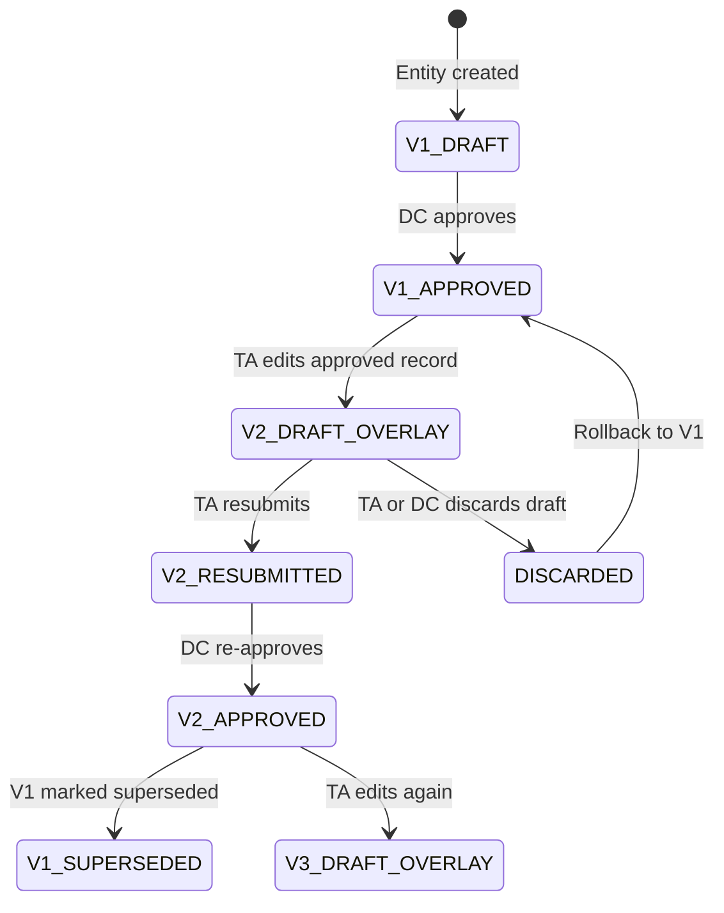
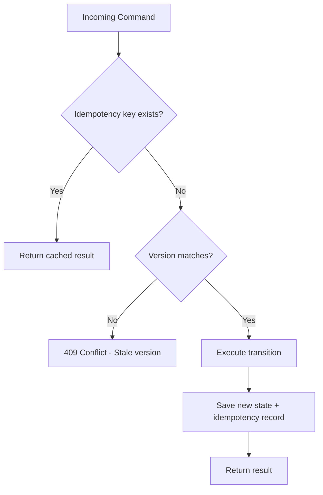

# Temple Registry — Architecture Recovery Blueprint

## Part 3: Versioning · Concurrency · API Contract

> Continuation of [Part 1](file:///C:/Users/adityaranjan/.gemini/antigravity/brain/3ed610c3-7ddd-4f2b-b5be-db066be61a64/artifacts/architecture_blueprint_part1.md) · [Part 2](file:///C:/Users/adityaranjan/.gemini/antigravity/brain/3ed610c3-7ddd-4f2b-b5be-db066be61a64/artifacts/architecture_blueprint_part2.md)

---

## §7 — Versioning & Edit-After-Approval

### 7.1 Current State (Problems)

| Module | Versioning Mechanism | Problems |
|---|---|---|
| **Declaration** | `AssetDeclarationVersion` table — copies entire declaration on resubmit | Full entity cloning is expensive, version comparison requires manual field-by-field diff, no structured diff output |
| **Temple Profile** | `SUPERSEDED` status on old `TempleProfileStaging` record | New staging record created, old marked SUPERSEDED. No field-level diff. `promoteToTemple()` on SUBMIT leaks unapproved data. |
| **Trust** | `GovernanceEditGuard` detects APPROVED edit → auto-resubmits | No version snapshot. Previous approved state is lost — DC cannot see what changed. `sendBackReason` is overwritten each time. |
| **Board Member** | None | No versioning at all. `isVerifiedByDc` reset on parent Trust edit silently. |

**Core problem:** There is no uniform "before vs. after" comparison capability. DC cannot see what TA changed when re-reviewing a modified record.

### 7.2 Target: Immutable Version Snapshots with Draft Overlay

#### Design Principles

1. **Approved data is immutable** — Once approved, the record is snapshotted. It never changes in-place.
2. **Edits create a draft overlay** — TA edits write to a staging/draft layer, not the approved record.
3. **Diff is computable** — The system can generate a structured diff between approved snapshot and draft overlay.
4. **Approval invalidation is explicit** — Editing an approved record transitions the workflow to `UPDATED_AFTER_APPROVAL`, requiring re-review.
5. **Rollback is simple** — Discard the draft overlay; the approved snapshot remains untouched.

#### Data Model

```
┌──────────────────────────────────────────────────────┐
│              entity_version                           │
├──────────────────────────────────────────────────────┤
│ id                  BIGINT PK                         │
│ workflow_instance_id BIGINT FK → workflow_instance    │
│ version_number      INT          -- 1, 2, 3...        │
│ status              VARCHAR(20)  -- APPROVED           │
│                                  -- SUPERSEDED         │
│                                  -- DRAFT_OVERLAY      │
│ snapshot_json       JSONB        -- full entity state  │
│ diff_json           JSONB        -- diff from prev     │
│                                  -- (nullable)         │
│ created_by          BIGINT FK → users                 │
│ created_at          TIMESTAMP                         │
│ approved_by         BIGINT (nullable)                 │
│ approved_at         TIMESTAMP (nullable)              │
└──────────────────────────────────────────────────────┘
```

#### Version Lifecycle



#### How It Works: Step by Step

**1. Initial Approval:**
```
TA submits Declaration → DC approves
  → VersionService.createApprovedSnapshot(declaration)
  → entity_version(version=1, status=APPROVED, snapshot=full JSON)
  → AssetDeclaration row remains as-is (source of truth for V1)
```

**2. TA Edits Approved Record:**
```
TA calls PUT /declarations/{id}
  → GovernanceEditGuard detects status=APPROVED
  → GovernanceEditGuard says: "requires resubmission"
  → Service updates AssetDeclaration fields in-place (the draft overlay)
  → WorkflowEngine transitions: APPROVED → UPDATED_AFTER_APPROVAL
  → VersionService.createDraftOverlay(declaration)
  → entity_version(version=2, status=DRAFT_OVERLAY, snapshot=new JSON)
  → DiffEngine.computeDiff(v1.snapshot, v2.snapshot) → stored in diff_json
  → Notification → DC: "Declaration X has been modified, re-review required"
```

**3. DC Reviews Changes:**
```
DC calls GET /declarations/{id}
  → Response includes:
    - Current data (from entity row)
    - workflowStatus: UPDATED_AFTER_APPROVAL
    - previousVersion: V1 snapshot
    - currentVersion: V2 snapshot
    - diff: structured field-level diff
    - availableActions: [RESUBMIT] (TA) or [APPROVE, REJECT, REQUEST_CLARIFICATION] (DC)
```

**4. DC Re-Approves:**
```
DC calls POST /workflow/{instanceId}/approve
  → WorkflowEngine transitions: RESUBMITTED → RE_APPROVED
  → VersionService.promoteToApproved(v2)
  → entity_version(version=2, status=APPROVED)
  → entity_version(version=1, status=SUPERSEDED)
```

**5. Rollback (Discard Draft):**
```
TA or DC calls POST /workflow/{instanceId}/discard-draft
  → WorkflowEngine transitions: UPDATED_AFTER_APPROVAL → APPROVED (rollback)
  → VersionService.discardDraftOverlay(v2)
  → Entity row restored from V1 snapshot
  → entity_version(version=2, status=DISCARDED)
```

#### Diff Engine

```java
public interface DiffEngine {

    /**
     * Compare two JSON snapshots and produce a structured diff.
     * Returns list of field-level changes with path, old value, new value.
     */
    List<FieldDiff> computeDiff(JsonNode before, JsonNode after);

    /**
     * Human-readable diff summary for UI display.
     */
    DiffSummary summarize(List<FieldDiff> diffs);
}

public record FieldDiff(
    String fieldPath,      // e.g., "trustName", "boardMembers[2].name"
    String sectionName,    // e.g., "Trust Details", "Board Members"
    Object oldValue,
    Object newValue,
    DiffType type          // ADDED, REMOVED, MODIFIED, UNCHANGED
) {}
```

#### Module-Specific Snapshot Strategy

| Module | What Gets Snapshotted | Notes |
|---|---|---|
| **Temple Profile** | `TempleProfileStaging` fields (name, address, deity, history, photos) | Replaces the current `promoteToTemple()` on submit bug. Promotion only happens on approval. |
| **Declaration** | `AssetDeclaration` + all child asset items (AgriLand, Building, Vehicle, etc.) | Replaces current `AssetDeclarationVersion` cloning approach. JSON snapshot is cheaper and supports diff. |
| **Trust** | `Trust` fields + `BoardMember[]` + `TrustFinancial[]` | Adds version tracking that Trust currently lacks entirely. |
| **Board Member** | Snapshotted as part of parent Trust snapshot | No independent versioning — board members are sub-entities of Trust. |

---

## §8 — Concurrency Model

### 8.1 Current State (Problems)

| Entity | Lock Type | Field | Problem |
|---|---|---|---|
| Trust | Optimistic (`@Version`) | `governanceVersion` | ✅ Works, but only for `WorkflowStateMachineService` path |
| Declaration | Optimistic + Pessimistic | `governanceVersion` + `SELECT FOR UPDATE` | Mixed strategy — pessimistic lock in `DeclarationWorkflowService`, optimistic in `GovernanceWorkflowService` |
| Temple Profile Staging | **None** | — | Two DCs can approve/reject simultaneously. Last write wins. |
| Board Member | **None** | — | `isVerifiedByDc` can be overwritten by concurrent DC actions |

### 8.2 Target: Uniform Optimistic Locking + Idempotent Commands

#### 8.2.1 Optimistic Locking via WorkflowInstance

Since all workflow state lives in `workflow_instance`, concurrency control centralizes there:

```java
@Entity
@Table(name = "workflow_instance")
public class WorkflowInstance {

    @Version
    private Integer version;  // JPA optimistic lock

    // ... other fields
}
```

**Every** workflow action requires the caller to supply the expected version:

```java
public record WorkflowActionRequest(
    WorkflowAction action,
    Integer expectedVersion,   // MUST match workflow_instance.version
    String comment,            // optional
    String idempotencyKey      // UUID from client
) {}
```

If `expectedVersion != instance.version` → throw `OptimisticLockException` → client must refetch and retry.

#### 8.2.2 Idempotent Commands

```
┌──────────────────────────────────────────────────────┐
│              idempotency_record                       │
├──────────────────────────────────────────────────────┤
│ idempotency_key    VARCHAR(64) PK                    │
│ workflow_instance_id BIGINT                           │
│ action             VARCHAR(40)                        │
│ result_status      VARCHAR(20)  -- SUCCESS / FAILED   │
│ result_json        JSONB                              │
│ created_at         TIMESTAMP                         │
│ expires_at         TIMESTAMP    -- TTL for cleanup     │
└──────────────────────────────────────────────────────┘
```

**Flow:**



#### 8.2.3 Transactional Boundaries

```java
@Service
public class WorkflowEngineImpl implements WorkflowEngine {

    @Transactional(isolation = Isolation.READ_COMMITTED)
    public WorkflowTransitionResult execute(
            Long workflowInstanceId,
            WorkflowActionRequest request) {

        // 1. Idempotency check (within same TX)
        var cached = idempotencyRepo.findById(request.idempotencyKey());
        if (cached.isPresent()) return cached.get().toResult();

        // 2. Load workflow instance (optimistic lock via @Version)
        var instance = workflowInstanceRepo.findById(workflowInstanceId)
            .orElseThrow(() -> new EntityNotFoundException(...));

        // 3. Version check (defense-in-depth beyond JPA @Version)
        if (!instance.getVersion().equals(request.expectedVersion())) {
            throw new OptimisticLockException("Stale version");
        }

        // 4. Validate transition (rules + policies)
        transitionValidator.validate(instance, request.action(), context);

        // 5. Execute transition
        instance.setStatus(rule.toStatus());
        instance.setSubStatus(rule.subStatusEffect());
        instance.setUpdatedAt(Instant.now());

        // 6. Save (JPA increments @Version automatically)
        workflowInstanceRepo.save(instance);

        // 7. Record idempotency
        idempotencyRepo.save(new IdempotencyRecord(request.idempotencyKey(), ...));

        // 8. Record audit
        auditService.logTransition(instance, request);

        // 9. Publish event (AFTER commit via @TransactionalEventListener)
        eventPublisher.publishEvent(new WorkflowTransitionEvent(instance, request));

        return new WorkflowTransitionResult(instance);
    }
}
```

> [!IMPORTANT]
> The domain event is published via `@TransactionalEventListener(phase = AFTER_COMMIT)`. This ensures notifications are only sent if the transaction actually commits. This fixes the current bug where some notification events are created inside the same TX as the state change — if the TX rolls back, a phantom notification event persists.

#### 8.2.4 Race Condition Prevention Matrix

| Scenario | Current Behavior | Target Behavior |
|---|---|---|
| Two DCs approve same declaration simultaneously | Path A: last-write-wins. Path B: `findByIdWithLock()` blocks second caller. | `OptimisticLockException` on second caller → 409 Conflict |
| TA submits while DC is approving | No protection on Temple Profile. Trust/Declaration have version check. | Version mismatch detected → 409 Conflict |
| Duplicate submit button click | `IdempotencyRecord` exists for Declaration only. None for Trust/Temple. | Universal idempotency via `idempotencyKey` on all commands |
| DC approves stale version (TA edited between load and approve) | Trust: version check catches. Declaration Path A: no protection. | Universal `expectedVersion` check catches all cases |
| Two TAs edit same draft | No protection anywhere | `@Version` on entity row prevents lost updates |

#### 8.2.5 Removing Pessimistic Locking

The current `findByIdWithLock()` (SELECT FOR UPDATE) in `DeclarationWorkflowService` should be **removed** in favor of optimistic locking:

| Approach | Pros | Cons |
|---|---|---|
| Pessimistic (current) | Guarantees serialization | Blocks threads, deadlock risk, doesn't scale, DB connection held during lock |
| **Optimistic (target)** | Non-blocking, scalable, no deadlocks | Requires retry logic on conflict (rare in practice — governance actions are infrequent) |

---

## §9 — API Contract Architecture

### 9.1 Current State (Problems)

Each module returns its own response shape with embedded status fields:

- Declaration: `status` (DeclarationStatus) + `physicalVerificationStatus` + `systemVerificationStatus`
- Trust: `submissionStatus` + `dcDecisionStatus` + `systemVerificationStatus`
- Temple Profile: `status` (TempleProfileStagingStatus)
- Board Member: `isVerifiedByDc` (boolean) + `dcFlagReason`

**Problems:**
- Frontends must understand 4+ different status models
- `DcDecisionStatus` is exposed but is a phantom (never drives logic)
- No standard way to query "what actions can I take?"
- No standard way to get clarification or task status alongside entity data
- Dashboard queries require module-specific endpoints

### 9.2 Target: Uniform WorkflowEnvelope

Every governable entity response wraps domain data in a standard workflow envelope:

```json
{
  "data": {
    // Module-specific payload — Trust fields, Declaration fields, etc.
    "trustName": "Sri Ramanuja Trust",
    "registrationNumber": "TR-2024-001",
    "boardMembers": [ ... ]
  },

  "workflow": {
    "instanceId": 42,
    "entityType": "TRUST",
    "status": "SUBMITTED",
    "subStatus": null,
    "version": 3,
    "currentActor": "DC",
    "createdAt": "2026-04-20T10:30:00Z",
    "updatedAt": "2026-04-25T14:15:00Z",
    "deadlineAt": null,

    "availableActions": [
      { "action": "APPROVE", "label": "Approve Trust", "requiresComment": false },
      { "action": "REJECT", "label": "Reject Trust", "requiresComment": true },
      { "action": "REQUEST_CLARIFICATION", "label": "Request Clarification", "requiresComment": true },
      { "action": "SEND_BACK", "label": "Send Back", "requiresComment": true }
    ],

    "pendingTasks": [],

    "clarificationSummary": {
      "totalRounds": 0,
      "activeThreads": 0,
      "lastRoundStatus": null
    },

    "versionSummary": {
      "currentVersion": 1,
      "hasUnapprovedChanges": false,
      "diffAvailable": false
    },

    "auditSummary": {
      "totalActions": 2,
      "lastAction": "SUBMIT",
      "lastActionAt": "2026-04-25T14:15:00Z",
      "lastActionBy": "temple_admin_01"
    }
  },

  "notifications": {
    "unreadCount": 1,
    "latestMessage": "Trust data submitted for DC review"
  }
}
```

### 9.3 Available Actions Resolution

The `availableActions` array is computed by the `WorkflowEngine` based on:

1. **Current status** → which transitions are valid?
2. **Current actor role** → which transitions is this user allowed to execute?
3. **Policy constraints** → any blocking conditions (blocking tasks, failed verification)?
4. **Module-specific rules** → entity-type-specific action availability

```java
public interface ActionResolver {

    /** Compute available actions for a user on a workflow instance */
    List<AvailableAction> resolve(WorkflowInstance instance, Long actorId);
}

public record AvailableAction(
    WorkflowAction action,
    String label,             // human-readable
    boolean requiresComment,  // UI hint
    boolean requiresVersion,  // UI must send expectedVersion
    String confirmationMessage // optional "Are you sure?" text
) {}
```

### 9.4 Dashboard / List API

For DC dashboards that show items across all modules:

```
GET /api/v1/workflow/dashboard?
  districtId=5&
  status=SUBMITTED,CLARIFICATION_RESPONDED&
  entityType=TRUST,DECLARATION&
  page=0&size=20&sort=updatedAt,desc
```

Response:

```json
{
  "content": [
    {
      "instanceId": 42,
      "entityType": "TRUST",
      "entityId": 15,
      "status": "SUBMITTED",
      "entitySummary": "Sri Ramanuja Trust — Bangalore Urban",
      "submittedAt": "2026-04-25T14:15:00Z",
      "submittedBy": "temple_admin_01",
      "pendingTaskCount": 0,
      "activeClarificationCount": 0
    },
    {
      "instanceId": 58,
      "entityType": "DECLARATION",
      "entityId": 22,
      "status": "CLARIFICATION_RESPONDED",
      "entitySummary": "FY 2025-26 Declaration — Chamundi Temple",
      "submittedAt": "2026-04-20T09:00:00Z",
      "submittedBy": "temple_admin_02",
      "pendingTaskCount": 1,
      "activeClarificationCount": 1
    }
  ],
  "totalElements": 47,
  "page": 0,
  "size": 20
}
```

> [!TIP]
> This **single dashboard endpoint** replaces the current need for `DcDashboardServiceImpl` to query Trust, Declaration, and Temple Profile separately with different status models. One query, one status model, all modules.

### 9.5 What the API Must NOT Expose

| Current Field | Why It Must Die | Replacement |
|---|---|---|
| `dcDecisionStatus` | Redundant with `submissionStatus`; phantom field | `workflow.status` covers it |
| `isVerifiedByDc` (boolean) | Ambiguous (false = unreviewed OR rejected) | `workflow.status` = `APPROVED` / `REJECTED` / `DRAFT` |
| `physicalVerificationStatus` | Internal DC concern, not a top-level status | `workflow.subStatus` + `workflow.pendingTasks[]` |
| `systemVerificationStatus` | Internal system concern | Separate `systemChecks` object if needed, never in workflow status |
| Raw `clarificationRound` int | Implementation detail | `workflow.clarificationSummary` with structured data |

### 9.6 Backward Compatibility

During migration, old API endpoints continue to work via a **compatibility mapper**:

```java
@Component
public class LegacyResponseMapper {

    /** Map new WorkflowInstance status to old Trust SubmissionStatus for legacy API */
    public SubmissionStatus toLegacyTrustStatus(WorkflowStatus status) {
        return switch (status) {
            case DRAFT -> SubmissionStatus.DRAFT;
            case SUBMITTED, RESUBMITTED -> SubmissionStatus.SUBMITTED;
            case APPROVED, RE_APPROVED -> SubmissionStatus.APPROVED;
            case REJECTED -> SubmissionStatus.REJECTED;
            case CLARIFICATION_REQUESTED -> SubmissionStatus.SENT_BACK;
            default -> SubmissionStatus.DRAFT;
        };
    }

    /** Map new status to old DeclarationStatus for legacy API */
    public DeclarationStatus toLegacyDeclarationStatus(
            WorkflowStatus status, String subStatus) {
        if (subStatus != null) {
            return switch (subStatus) {
                case "SITE_VISIT_SCHEDULED" -> DeclarationStatus.SITE_VISIT_SCHEDULED;
                case "SITE_VISIT_COMPLETED" -> DeclarationStatus.SITE_VISIT_COMPLETED;
                case "PHYSICALLY_VERIFIED" -> DeclarationStatus.VERIFIED;
                default -> mapBaseStatus(status);
            };
        }
        return mapBaseStatus(status);
    }
}
```

Old endpoints (e.g., `GET /api/v1/trusts/{id}`) return legacy shapes with mapped statuses. New endpoints (e.g., `GET /api/v2/trusts/{id}`) return the `WorkflowEnvelope` shape. Both run in parallel until frontend migration is complete.
