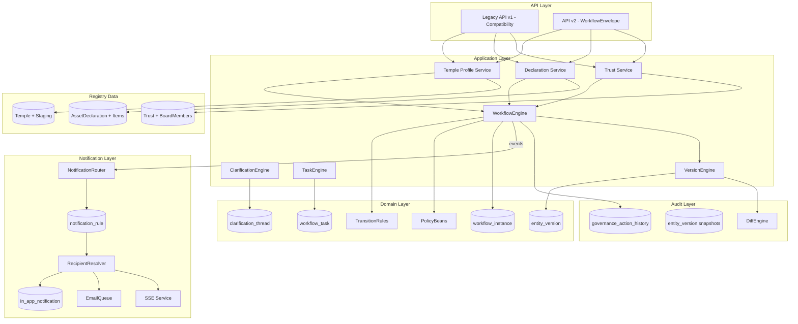
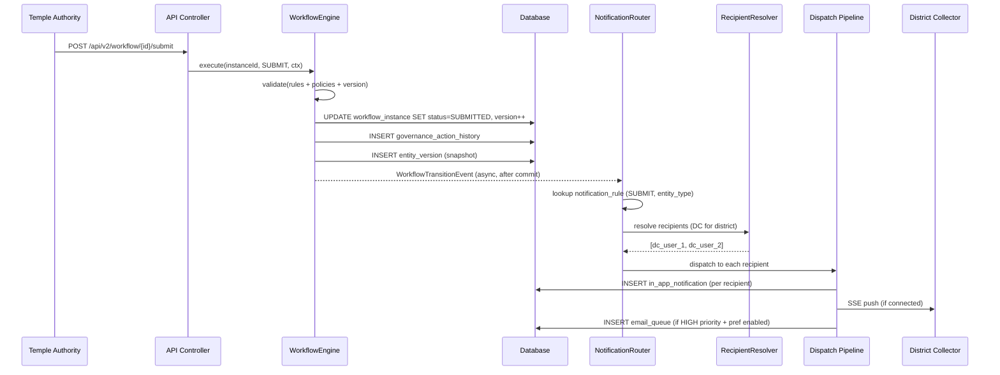
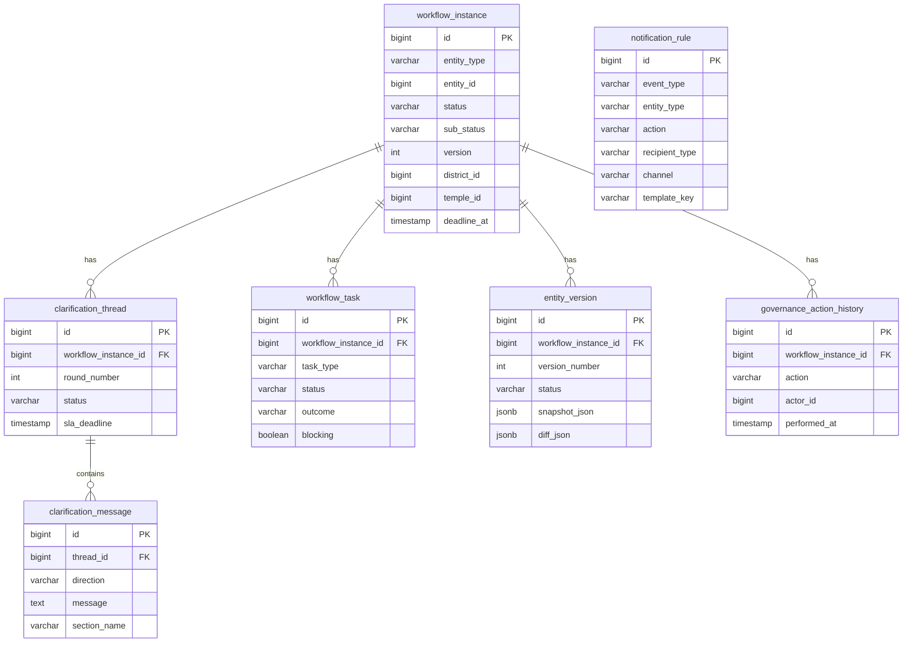
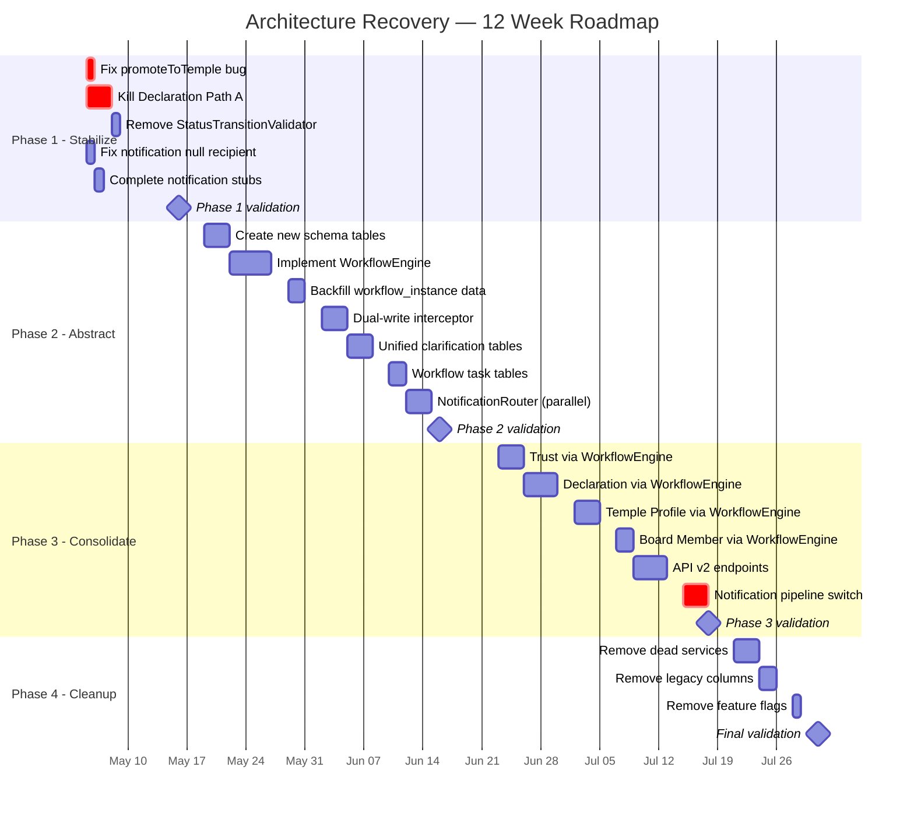

# Temple Registry — Architecture Recovery Blueprint

## Part 4: Migration · Anti-Patterns · Final Recommendation

> Continuation of [Part 1](file:///C:/Users/adityaranjan/.gemini/antigravity/brain/3ed610c3-7ddd-4f2b-b5be-db066be61a64/artifacts/architecture_blueprint_part1.md) · [Part 2](file:///C:/Users/adityaranjan/.gemini/antigravity/brain/3ed610c3-7ddd-4f2b-b5be-db066be61a64/artifacts/architecture_blueprint_part2.md) · [Part 3](file:///C:/Users/adityaranjan/.gemini/antigravity/brain/3ed610c3-7ddd-4f2b-b5be-db066be61a64/artifacts/architecture_blueprint_part3.md)

---

## §10 — Migration Strategy

> [!IMPORTANT]
> This migration must be **zero-downtime** and **backward-compatible** at every phase boundary. No big-bang cutover.

### Phase 1 — Stabilization (Weeks 1–2)

**Goal:** Fix critical bugs and eliminate the most dangerous code paths WITHOUT architectural changes.

| Task | Detail | Risk | Rollback |
|---|---|---|---|
| **Fix Bug 7.1** — Remove `promoteToTemple()` from `submitForReview()` | Temple data must only promote on APPROVE | 🟡 Medium — verify no frontend depends on submit-time promotion | Revert single method change |
| **Kill Declaration Path A** — Redirect `DeclarationController` workflow endpoints to `GovernanceWorkflowServiceImpl` | `submit()`, `approve()`, `reject()`, `requestClarification()` all delegate to governance path | 🔴 High — frontend may call either controller | Feature flag: `declaration.legacyPath.enabled=true` to fallback |
| **Remove `StatusTransitionValidator`** (util package) | Keep only `StateTransitionValidator` (declaration package) | 🟡 Medium — grep all callers first | Keep old class as dead code with `@Deprecated` |
| **Fix null recipientId** in Temple Profile submit notification | Use `NotificationRecipientResolver` instead of hardcoded null | 🟢 Low | None needed |
| **Complete TODO stubs** in `NotificationEventPublisherImpl` | Temple verified/flagged/unflagged events actually dispatch | 🟢 Low | Feature flag per event type |

**Schema changes:** None.
**Data migration:** None.
**Feature flags:** `declaration.legacyPath.enabled`, `notification.templeProfile.modern.enabled`

### Phase 2 — Abstraction (Weeks 3–6)

**Goal:** Introduce the Governance Domain layer alongside existing code. Dual-write.

| Task | Detail | Risk | Rollback |
|---|---|---|---|
| **Create `workflow_instance` table** | New table, no FK constraints to existing entities | 🟢 Low | Drop table |
| **Create `WorkflowEngine` service** | New Spring service. Does NOT replace existing services yet. | 🟢 Low | Remove bean |
| **Backfill `workflow_instance`** from existing entity statuses | Migration script reads Trust.submissionStatus, Declaration.status, TempleProfileStaging.status → creates workflow_instance rows | 🟡 Medium — must map all current statuses correctly | Delete backfilled rows |
| **Dual-write interceptor** | `@Aspect` or service decorator that writes to BOTH entity status field AND workflow_instance on every transition | 🟡 Medium — must be transactional | Disable aspect via flag |
| **Create `clarification_thread` + `clarification_message` tables** | Generalized from `DeclarationClarification` | 🟢 Low | Drop tables |
| **Backfill clarification data** | Copy `DeclarationClarification` rows → `clarification_thread` + `clarification_message` | 🟡 Medium | Delete backfilled rows |
| **Create `workflow_task` table** | Generalized site visit model | 🟢 Low | Drop table |
| **Backfill site visit data** | Map `PhysicalVerificationHistory` → `workflow_task` rows | 🟡 Medium | Delete backfilled rows |
| **Add `@Version` to `TempleProfileStaging`** | Optimistic locking for temple profile | 🟢 Low | Remove annotation |
| **Create `entity_version` table** | Version snapshot storage | 🟢 Low | Drop table |
| **Create `notification_rule` table** | Declarative notification routing | 🟢 Low | Drop table |
| **Implement `NotificationRouter`** as parallel listener | Listens to `WorkflowTransitionEvent`, routes via rules. Runs alongside existing `NotificationHelper`. | 🟡 Medium — dedup guard critical | Disable listener |

**Schema changes:** 6 new tables, 1 column addition (`@Version` on TempleProfileStaging).
**Data migration:** Backfill scripts for workflow_instance, clarification, tasks.
**Feature flags:** `workflow.dualWrite.enabled`, `notification.router.enabled`, `clarification.unified.enabled`

**Validation checkpoint:** At end of Phase 2, verify:
- Every entity has a corresponding `workflow_instance` row
- `workflow_instance.status` matches entity's native status field
- Clarification threads match `DeclarationClarification` data
- All existing tests pass
- Frontend works unchanged (still uses old API shapes)

### Phase 3 — Consolidation (Weeks 7–10)

**Goal:** Switch reads to `workflow_instance` as source of truth. Migrate API responses.

| Task | Detail | Risk | Rollback |
|---|---|---|---|
| **`WorkflowEngine` becomes primary** | All workflow transitions go through `WorkflowEngine.execute()`. Entity status fields become derived. | 🔴 High — all workflow paths change | Feature flag: `workflow.engine.primary=false` reverts to old paths |
| **Migrate Trust workflow** | `GovernanceWorkflowServiceImpl.submitTrust()` → `workflowEngine.execute(SUBMIT)`. Remove inline `assertCanSubmit()`. | 🟡 Medium | Flag per module: `workflow.trust.engine=false` |
| **Migrate Declaration workflow** | `GovernanceWorkflowServiceImpl.submitDeclaration()` → `workflowEngine.execute(SUBMIT)`. Remove `StateTransitionValidator` direct calls. | 🟡 Medium | Flag: `workflow.declaration.engine=false` |
| **Migrate Temple Profile workflow** | `TempleProfileStagingServiceImpl.submitForReview()` → `workflowEngine.execute(SUBMIT)`. Add SENT_BACK state. | 🟡 Medium | Flag: `workflow.templeProfile.engine=false` |
| **Migrate Board Member** | Replace `isVerifiedByDc` boolean with workflow_instance. | 🟡 Medium | Flag: `workflow.boardMember.engine=false` |
| **Introduce API v2** | New endpoints returning `WorkflowEnvelope` shape. Old v1 endpoints unchanged. | 🟢 Low — additive | Remove v2 routes |
| **Migrate notification** to `NotificationRouter` only | Remove all `NotificationHelper.notify*()` calls. `NotificationRouter` handles all dispatch via rules. | 🔴 High — many call sites | Flag: `notification.pipeline=LEGACY` |
| **Remove `DcDecisionStatus`** from Trust entity | Field was always redundant. Remove from entity + DTO. | 🟡 Medium — frontend may display it | Keep field, stop writing to it |
| **Unified clarification** for Trust | Replace `sendBackReason` string with `ClarificationEngine` calls. | 🟡 Medium | Flag: `clarification.trust.unified=false` |

**Schema changes:** Add `SENT_BACK` to `TempleProfileStagingStatus`. Add `BoardMemberVerificationStatus` enum. `DcDecisionStatus` column retained but deprecated.
**Feature flags:** Per-module engine flags, notification pipeline flag.

### Phase 4 — Cleanup (Weeks 11–12)

**Goal:** Remove all dead code, legacy paths, redundant fields.

| Task | Detail | Risk |
|---|---|---|
| Delete `DeclarationServiceImpl.submit/approve/reject/requestClarification` | Dead code after Phase 3 | 🟢 Low |
| Delete `StatusTransitionValidator` (util) | Fully replaced | 🟢 Low |
| Delete `StateTransitionValidator` (declaration) | Replaced by `WorkflowEngine` transition rules | 🟢 Low |
| Delete `WorkflowStateMachineServiceImpl` | Replaced by `WorkflowEngine` | 🟡 Medium — verify no remaining callers |
| Delete `NotificationHelper` class | Replaced by `NotificationRouter` | 🟡 Medium |
| Delete `NotificationService` (legacy) | Replaced by unified pipeline | 🟢 Low |
| Delete `NotificationEventPublisherImpl` (dc package) | Legacy publisher | 🟢 Low |
| Remove `DcDecisionStatus` column from Trust table | Schema migration | 🟢 Low |
| Remove `isVerifiedByDc` column from BoardMember table | Replaced by workflow_instance | 🟢 Low |
| Remove `sendBackReason` column from Trust table | Replaced by clarification_thread | 🟢 Low |
| Remove `clarificationRound` from AssetDeclaration | Replaced by clarification_thread round tracking | 🟢 Low |
| Remove `physicalVerificationStatus` from AssetDeclaration | Replaced by workflow_task | 🟢 Low |
| Remove all per-module feature flags | Cleanup | 🟢 Low |
| Deprecate API v1 endpoints | Add sunset header | 🟢 Low |
| Archive `DeclarationClarification` table | Data migrated to `clarification_thread` | 🟢 Low |
| Archive `PhysicalVerificationHistory` table | Data migrated to `workflow_task` | 🟢 Low |

---

## §11 — Anti-Patterns to Eliminate

### The Kill List

| # | Anti-Pattern | Where It Lives | What Replaces It |
|---|---|---|---|
| 1 | **Dual-path service mutation** | `DeclarationServiceImpl` + `GovernanceWorkflowServiceImpl` both mutate `AssetDeclaration.status` | Single `WorkflowEngine.execute()` — all transitions flow through one path |
| 2 | **Dual validators** | `StateTransitionValidator` + `StatusTransitionValidator` with conflicting rules | `TransitionRule` table in `WorkflowEngine` — one rule set, one lookup |
| 3 | **Direct entity status mutation** | `declaration.setStatus(X)` called in 6+ places across 3 services | Entity status fields become **read-only projections** of `workflow_instance.status` |
| 4 | **Boolean governance flags** | `BoardMember.isVerifiedByDc` — ambiguous (false = unreviewed OR rejected) | Proper `WorkflowStatus` via `workflow_instance` row per board member |
| 5 | **Shadow DTO status** | `Trust.dcDecisionStatus` exposed in API but never drives logic | Removed entirely. `workflow.status` is the single truth. |
| 6 | **Mixed notification systems** | Legacy `NotificationService.notify()` + modern `NotificationHelper` + legacy `NotificationEventPublisherImpl` | Single `NotificationRouter` driven by declarative `notification_rule` table |
| 7 | **Module-specific ad hoc clarification** | `DeclarationClarification` (full model) vs `Trust.sendBackReason` (string) vs Temple Profile (nothing) | Unified `ClarificationEngine` with `clarification_thread` + `clarification_message` |
| 8 | **Promote on SUBMIT** | `TempleProfileStagingServiceImpl.submitForReview()` calls `promoteToTemple()` leaking unapproved data | Promotion only on `APPROVE`. Draft data stays in staging. |
| 9 | **Inline transition guards** | `assertCanSubmit()`, `assertDcCanAct()` — hardcoded `if` statements | `TransitionRule` lookup + `WorkflowPolicy` beans |
| 10 | **Write/read mismatch** | `notifyDeclarationUpdated()` method exists but is never called | Event-driven: `WorkflowTransitionEvent` automatically triggers matching notification rules |
| 11 | **Phantom notification events** | Legacy publisher creates `NotificationEvent` rows but no `InAppNotification` — user never sees them | Single pipeline: event → route → resolve recipients → persist in-app + queue email |
| 12 | **No optimistic locking on Temple Profile / Board Member** | Concurrent DC actions silently overwrite each other | Universal `@Version` on `workflow_instance` |
| 13 | **Redundant overdue mechanisms** | `OverdueScheduler` (daily, boolean only) + `DeclarationServiceImpl.flagOverdue()` (yearly, boolean + status) | Single `OverduePolicy` in workflow engine. Overdue = sub-status, not top-level status. |
| 14 | **`isOverdue` boolean + `OVERDUE` enum** | Two representations of overdue on Declaration | Remove `OVERDUE` from status enum. Keep boolean as derived field from deadline. |

---

## §12 — Final Recommendation

### 12.1 Target Architecture — Component Diagram



### 12.2 Canonical Workflow State Diagram

```mermaid
stateDiagram-v2
    direction TB
    [*] --> DRAFT
    DRAFT --> SUBMITTED : TA submits
    SUBMITTED --> UNDER_REVIEW : DC begins review
    SUBMITTED --> APPROVED : DC approves directly
    SUBMITTED --> REJECTED : DC rejects
    SUBMITTED --> CLARIFICATION_REQUESTED : DC requests info

    UNDER_REVIEW --> APPROVED : DC approves
    UNDER_REVIEW --> REJECTED : DC rejects
    UNDER_REVIEW --> CLARIFICATION_REQUESTED : DC requests info

    CLARIFICATION_REQUESTED --> CLARIFICATION_RESPONDED : TA responds
    CLARIFICATION_RESPONDED --> UNDER_REVIEW : DC re-reviews
    CLARIFICATION_RESPONDED --> APPROVED : DC approves
    CLARIFICATION_RESPONDED --> REJECTED : DC rejects

    APPROVED --> UPDATED_AFTER_APPROVAL : TA edits
    UPDATED_AFTER_APPROVAL --> RESUBMITTED : TA resubmits
    RESUBMITTED --> RE_APPROVED : DC re-approves
    RESUBMITTED --> REJECTED : DC rejects
    RE_APPROVED --> UPDATED_AFTER_APPROVAL : TA edits again
    APPROVED --> SUPERSEDED : New version
    RE_APPROVED --> SUPERSEDED : New version

    note right of UNDER_REVIEW : Sub-states here: SITE_VISIT_SCHEDULED, SITE_VISIT_COMPLETED, PHYSICALLY_VERIFIED, etc.
    note right of CLARIFICATION_REQUESTED : Sub-state: ESCALATED_TO_SUPER_ADMIN (round >= threshold)
```

### 12.3 Event Flow Diagram



### 12.4 Data Model Summary



### 12.5 Migration Roadmap



### 12.6 Estimated Effort

| Phase | Scope | Effort (person-days) | Team Size | Calendar |
|---|---|---|---|---|
| **Phase 1** — Stabilize | Bug fixes, path elimination | 8–10 days | 1 dev | 2 weeks |
| **Phase 2** — Abstract | New tables, engine, backfill, dual-write | 18–22 days | 2 devs | 4 weeks |
| **Phase 3** — Consolidate | Module migration, API v2, notification switch | 20–25 days | 2 devs | 4 weeks |
| **Phase 4** — Cleanup | Dead code removal, column drops | 5–7 days | 1 dev | 2 weeks |
| **Total** | | **51–64 person-days** | | **12 weeks** |

### 12.7 Risk Matrix

| Risk | Probability | Impact | Mitigation |
|---|---|---|---|
| Frontend breaks when Declaration Path A removed | 🟠 Medium | 🔴 High | Feature flag `declaration.legacyPath.enabled`. Grep frontend for both endpoint patterns before removal. |
| Backfill script maps statuses incorrectly | 🟡 Low | 🔴 High | Write comprehensive unit tests for status mapping. Run on staging with production data copy first. |
| Dual-write causes performance degradation | 🟡 Low | 🟡 Medium | `workflow_instance` writes are simple INSERTs/UPDATEs. Benchmark under load. |
| Notification dedup fails → duplicate notifications | 🟡 Low | 🟡 Medium | Use DB unique constraint on dedup key as fallback. Monitor notification counts during dual-write. |
| `@Version` optimistic lock causes user-visible errors | 🟠 Medium | 🟡 Medium | Frontend must handle 409 Conflict gracefully with "refresh and retry" UX. Governance actions are low-frequency. |
| Phase 3 module migration introduces regressions | 🟠 Medium | 🔴 High | Per-module feature flags. Comprehensive integration test suite. 1-week soak per module before next. |
| Data loss during column removal in Phase 4 | 🟡 Low | 🔴 High | Soft-delete columns first (stop writing, keep reading). Drop only after 2-week soak. Full backup before DDL. |

### 12.8 Success Criteria

The architecture recovery is complete when:

- [ ] **One workflow engine** handles all state transitions across all modules
- [ ] **Zero** direct `entity.setStatus()` calls outside the workflow engine
- [ ] **One** notification pipeline (NotificationRouter + rules table)
- [ ] **Zero** boolean governance flags (isVerifiedByDc eliminated)
- [ ] **Zero** shadow/redundant status fields (DcDecisionStatus eliminated)
- [ ] **One** clarification model used by all modules
- [ ] **One** task model used for site visits and future task types
- [ ] Every workflow action is **idempotent** and **version-checked**
- [ ] Every state transition produces an **audit record** and a **domain event**
- [ ] API v2 returns uniform **WorkflowEnvelope** for all modules
- [ ] DC dashboard is a **single query** across all entity types
- [ ] Edit-after-approval produces a **computable diff** viewable by DC
- [ ] All existing business flows work identically from the user's perspective

---

## Document Index

| Part | Sections | Link |
|---|---|---|
| **Part 1** | §1 Domain Architecture · §2 Canonical Workflow · §3 Governable Abstraction | [architecture_blueprint_part1.md](file:///C:/Users/adityaranjan/.gemini/antigravity/brain/3ed610c3-7ddd-4f2b-b5be-db066be61a64/artifacts/architecture_blueprint_part1.md) |
| **Part 2** | §4 Clarification Architecture · §5 Site Visit/Task Architecture · §6 Notification Architecture | [architecture_blueprint_part2.md](file:///C:/Users/adityaranjan/.gemini/antigravity/brain/3ed610c3-7ddd-4f2b-b5be-db066be61a64/artifacts/architecture_blueprint_part2.md) |
| **Part 3** | §7 Versioning & Edit-After-Approval · §8 Concurrency Model · §9 API Contract | [architecture_blueprint_part3.md](file:///C:/Users/adityaranjan/.gemini/antigravity/brain/3ed610c3-7ddd-4f2b-b5be-db066be61a64/artifacts/architecture_blueprint_part3.md) |
| **Part 4** | §10 Migration Strategy · §11 Anti-Patterns · §12 Final Recommendation | This document |
