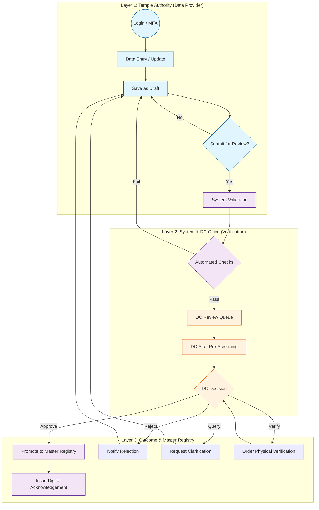
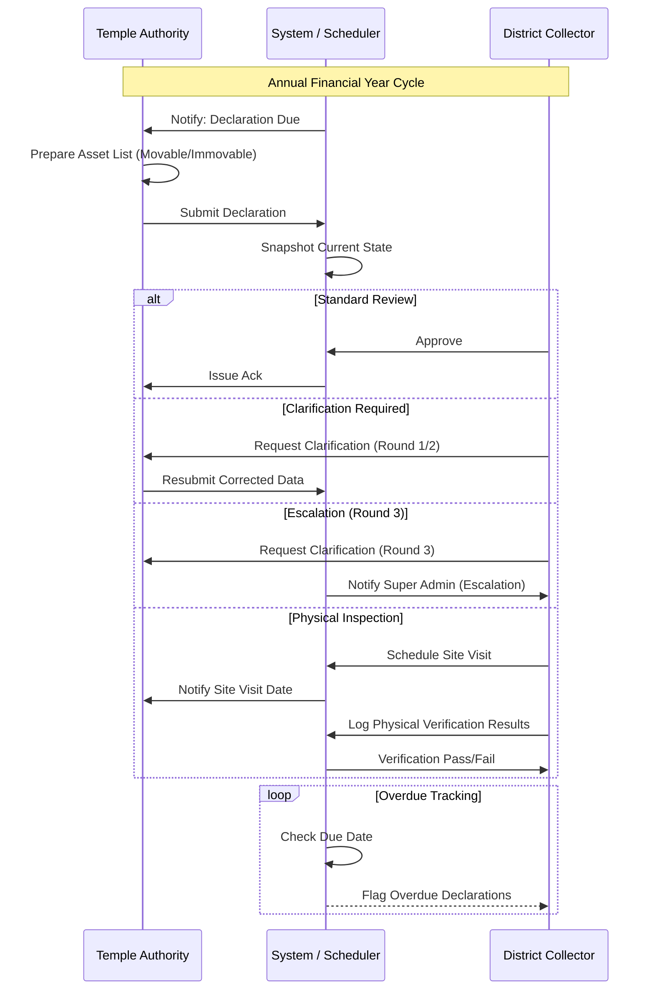
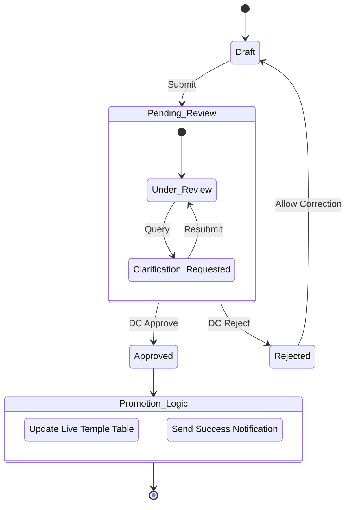

# Temple Registry: Unified Governance Workflow

This document provides a visual representation of the scalable workflow architecture for the Temple Registry & Management Portal, as derived from the requirements specification.

## 1. High-Level Governance Architecture

The system uses a **3-Layer Governance Model** to ensure data integrity and jurisdiction-based oversight.

---

## 2. Detailed Module Workflows

### A. Asset Declaration Workflow (Deep Dive)
Asset declarations are subject to the most rigorous oversight, including physical inspection and deadline tracking.

### B. Temple Profile & Trust Staging Workflow
To prevent data corruption, changes to the Temple Master or Trust details are "staged" and only "promoted" upon approval.

---

## 3. Scalability Features of the Workflow

1.  **State Snapshotting**: Before any review, the system captures a JSON snapshot of the data. This ensures the DC reviews the *exact* data submitted, even if the TA continues editing a new draft.
2.  **Jurisdiction Scoping**: The Workflow Engine automatically routes tasks based on the `District_ID` and `Taluk_ID`, ensuring a DC only sees temples within their legal jurisdiction.
3.  **Optimistic Locking**: Every state transition uses a `governance_version` counter to prevent "double-approval" or race conditions in high-concurrency environments.
4.  **Asynchronous Summary Refreshes**: Upon approval, the system triggers background updates to the search indexes and dashboards, keeping the UI responsive.
5.  **Blind Indexing for Encryption**: Sensitive fields (PAN, Aadhaar) are encrypted at rest, but the workflow allows "Masked View" for DC Staff while maintaining full legal compliance.
